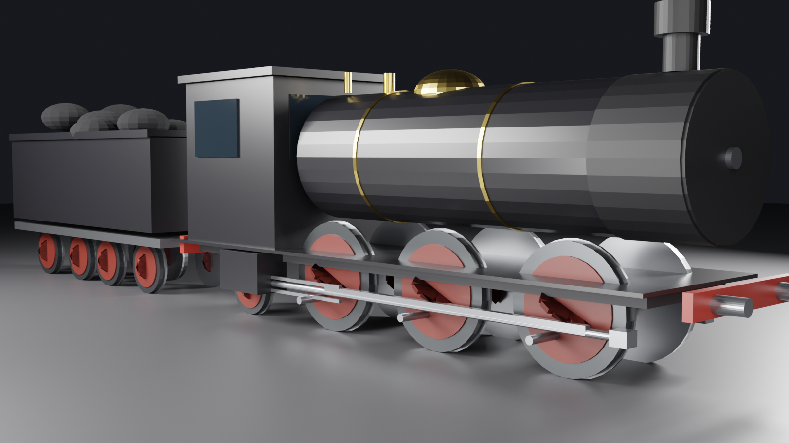
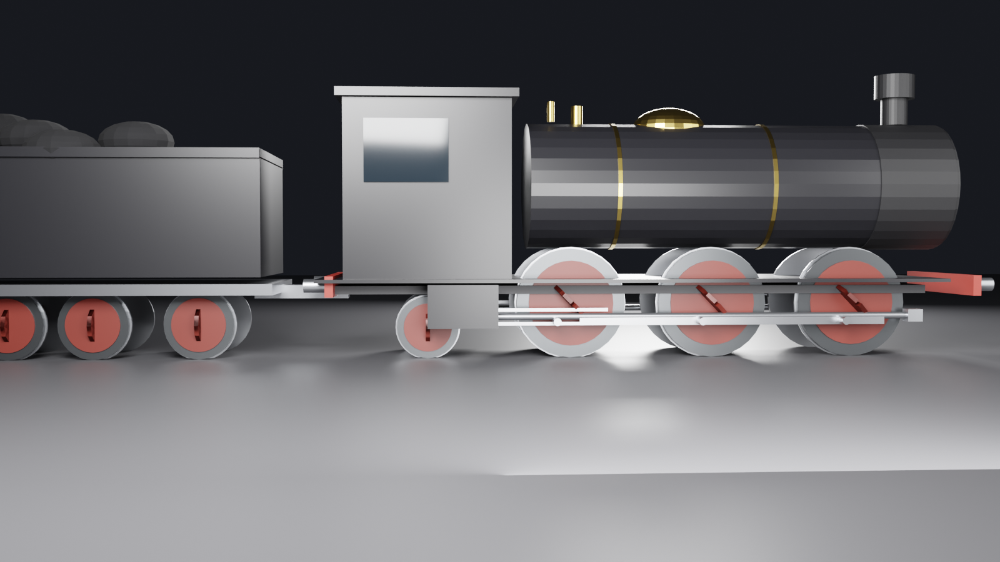
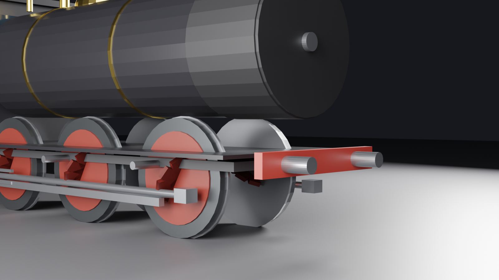
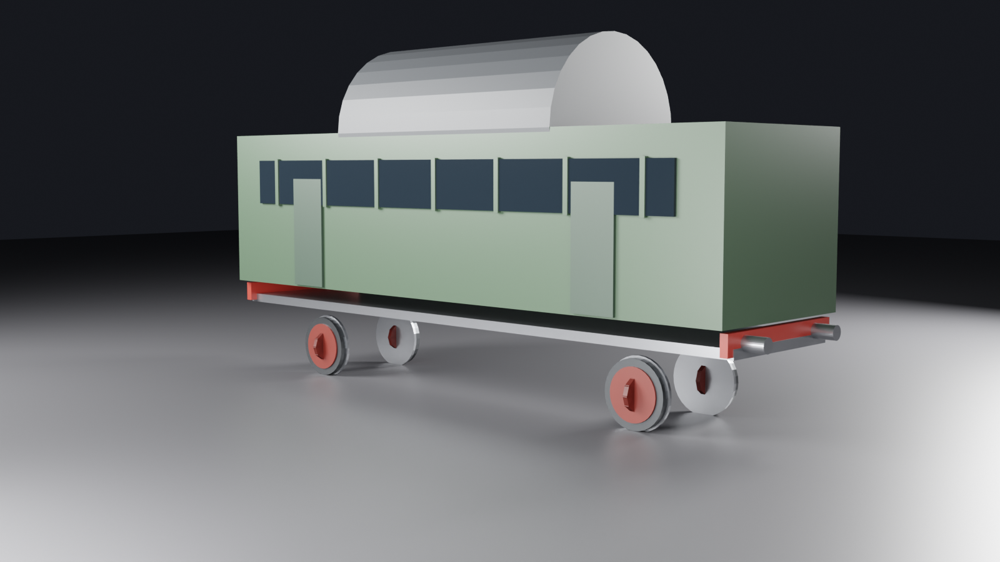
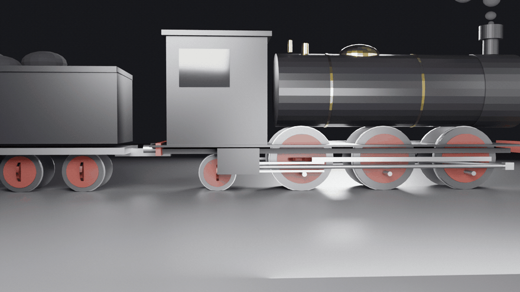

# 🚂 train-cinema

**EN:** A **functional steam locomotive** built from code — and it actually *works*: three coupled drivers with crank pins set at proper quartering (90°), side rods that stay rigid through the cycle, a main rod driving the crosshead, and pistons whose stroke is **exactly 2 × crank radius** — every pose solved by real slider-crank kinematics, not keyframes. Plus a coal-loaded tender.

**TR:** Kodla inşa edilmiş, **gerçekten çalışan** buharlı lokomotif — anahtar kare yok: üç kuplör tahrik tekeri, 90° quartering krank fazları, döngü boyunca rijit kalan yan iticiler, krosbaşı süren ana biyel ve strokesi **tam 2 × krank yarıçapı** olan pistonlar. Her poz gerçek slider-crank kinematiğiyle çözülür. Yanında kömür yüklü tender.



## 🖼️ Gallery / Galeri

### 🏭 Stüdyo — 3/4 ön

Brass boiler bands, dome and safety valves; red spoked drivers below. — *Pirinç kazan bantları, kubbe ve emniyet ventilleri; altta kırmızı ispitli tahrik tekerleri.*

### 📐 Yan cephe — mekanik açıktan

The full running gear: cylinders, crossheads, main + side rods, coupled drivers. — *Tam yürütücü mekanik: silindirler, krosbaşlar, ana + yan iticiler, kuplör tekerler.*

### 🔍 Ön detay

Smokebox door, buffer beam, pony truck and cylinder block. — *Duman kutusu kapağı, tampon kirişi, pony takım ve silindir bloğu.*

### 🚃 Yolcu vagonu — kemerli çatı

`vagon_kur("yolcu")` — arched roof, window band with mullions, doors, buffer beams; axles roll with the same no-slip law. — *Kemerli çatı, dikmeli pencere bandı, kapılar, tampon kirişleri; dingiler aynı kaysız yasayla döner.*

### ⚙️ Çalışma animasyonu

*36 frames at 12 fps — wheels roll, quartered cranks pump the pistons, chimney breathes. Rotasyon = kaysız yuvarlanma: θ = mesafe / teker yarıçapı.*

## 🧱 How it works / Nasıl çalışır

```
mekanik.py  (saf matematik, Blender'siz)
  krank pimi   : (cx + rc·sinθ, cz + rc·cosθ)
  krosbaş      : x = x_pin + √(L² − (z_pin − z_silindir)²)
  quartering   : sağ krank = sol + 90°
        ↓ her karede
tren.py  (Blender): teker boş nesneleri döner (pimler child → doğru orbitte),
  yan itici pimleri izler, ana biyel krosbaş→orta krank gerilir,
  piston çubuğu silindire kadar uzar; duman pufları nefes alır
```

## ✅ Verification / Doğrulama

```bash
python3 tests/verify.py
```

- **Stroke gate**: piston stroke = 2 × crank radius, analytic to 1e-9
- **Rigidity gate**: the three side-rod pins share one height at every angle
- **Quartering gate**: right crank = left + 90° at all sampled angles
- **Main-rod gate**: crosshead-to-pin distance = L at every angle (8.9e-16)
- **Orbit gate**: crank pins orbit at exactly crank radius
- **Determinism gate**

## 🚀 Usage / Kullanım

```bash
blender --background --python tren_render.py -- --scene scenes/studyo.json
HIZLI=1 blender --background --python tren_render.py -- --scene scenes/yan_cephe.json
blender --background --python tren_render.py -- --scene scenes/calisma.json --gif 36 --fps 12
# tek vagon stüdyo çekimi
blender --background --python tren_render.py -- --scene scenes/vagon_yolcu.json
```

Vagon tipleri: `vagon_kur(ad, "yolcu", boy)` / `vagon_kur(ad, "yuk", boy)` — railway-cinema bu fonksiyonla tren kurguluyor.

**Kardeş projeler:** [`rail-cinema`](https://github.com/efealtiparmakoglu/rail-cinema) bu lokomotifin hattını üretir; [`railway-cinema`](https://github.com/efealtiparmakoglu/railway-cinema) ikisini birleştirir.

## 🧪 Why / Neden

**TR:** Animasyonda tekerlek döner, herkes etkilendir. Ama krank pimi orbitte değilse, biyel boyu değişiyorsa, piston stroku uydurmayla 0.7 m değil 0.7015 m ise makine yalan söyler. Bu projede doğrulama kapıları makinenin yalan söylemesine izin vermiyor — render, kinematiğin kanıtının üstüne basılan mühür.

## 📄 License

MIT
